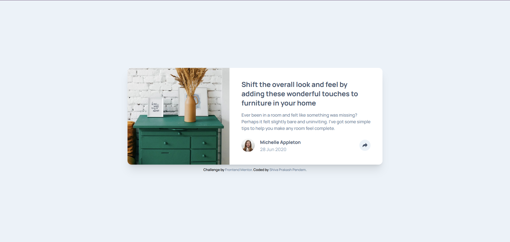
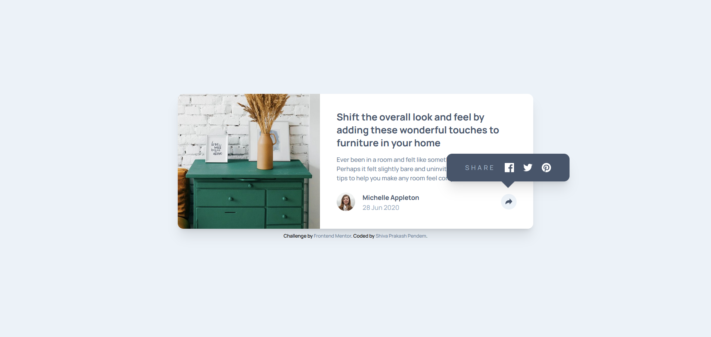
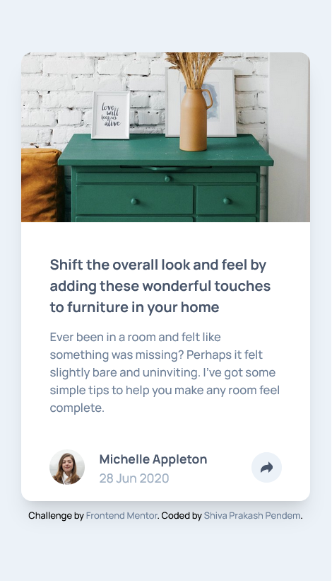
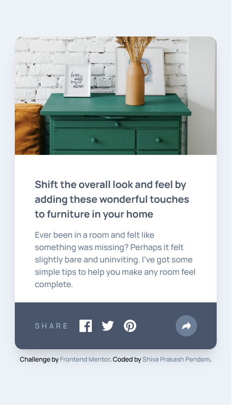

# Frontend Mentor - Article preview component solution

This is a solution to the [Article preview component challenge on Frontend Mentor](https://www.frontendmentor.io/challenges/article-preview-component-dYBN_pYFT). Frontend Mentor challenges help you improve your coding skills by building realistic projects.

## Table of contents

- [Overview](#overview)
  - [The challenge](#the-challenge)
  - [Screenshots](#screenshots)
  - [Links](#links)
- [My process](#my-process)
  - [Built with](#built-with)
  - [What I learned](#what-i-learned)
  - [Continued development](#continued-development)
  - [Useful resources](#useful-resources)
- [Author](#author)

## Overview

### The challenge

Users should be able to:

- View the optimal layout for the component depending on their device's screen size
- See the social media share links when they click the share icon

### Screenshots

#### Desktop View

##### Desktop Click View

#### Mobile View

##### Mobile Click View

### Links

- Solution URL: [GitHub repo](https://github.com/shivaprakash-sudo/article-preview-component)
- Live Site URL: [Article Preview Component](https://shivaprakash-sudo.github.io/article-preview-component/)

## My process

### Built with

- Semantic HTML5 markup
- Flexbox
- CSS Grid
- Mobile-first workflow
- Tailwind-css - For styles

### What I learned

Positioning and displaying the social icons container was harder than I thought it would be, but I eventually figured it out, by rearranging the content in html file.

### Continued development

I'd like to work more on positioning containers with respective their different parent containers.

### Useful resources

- [Tailwind-css](https://tailwindcss.com/docs/installation) - Official documentation

## Author

- Frontend Mentor - [@shivaprakash-sudo](https://www.frontendmentor.io/profile/shivaprakash-sudo)
